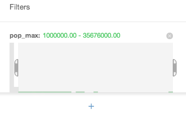

### Summary
This video tutorial will show the basics of using filters to explore data. Filters can be handy when looking for trends and patterns in data. You can use them to find out how the values in different columns are spread throughout your data. You can also combine multiple filters to really dig deep into what your data contains. Use the filters directly on your maps to see the results or even share maps of filtered results with others.

### Data Sources
Go to your cartodb account and go to the common data link and in order to import a popular dataset, the Populated Places dataset from Natural Earth. Click on the Populated Places title and cartodb will begin to import this data into a table on your account.

[Natural Earth Data](http://www.naturalearthdata.com/): data for borders, coastlines, cities, and many other useful collections!

### Styling your Data
Once that table has been imported go straight to the map. You are going to apply some styles so that the changes made by the filters can be seen more easily. Click the map view tab in order view the map which will look like this:

As can be seen the map is looking pretty busy. First reduce the size of the markers themselves. To do this by click the **Wizards icon** under the  SQL icon. Next change the value for the marker size and the stroke to something similiar the values shown in the images below.

It might also be a good idea to change the basemap so that the markers can be seen much more clearly. For this type of work the preferred basemap might be the CartoDB Dark layer which can be applied by clicking the Basemap dropdown on the top right and selecting the CartoDB Dark Layer.

Now that the map can be seen more clearly, it's time to get adding some filters.

### Adding Filters
Now go back to the table view by clicking the table tab on the top nav bar.

Filters are created by using the data that is contained within the columns of a table. To do so pick a column which is easy to understand and interpret. For instance you could use the **pop_max** which is the total population for the metropolitan area of each city within the table.

In order to add a filter click the **filter tray icon** from the right menu bar below the SQL icon.

When clicked this you are presented with the view below. Select the column to filter by from the drop down. In this case scroll through the list until you find the **pop_max** column.

CartoDB will then do a lookup on the column and create a simple histogram of that column. As can seen from this distribution there are many areas which have a very low population level on the left, while there are very few on the right where the highest values of population are. 

For instance if one wanted to only see those cities with the lowest population levels drag the slider so that only the first bar of the distribution is selected as can be seen below. As can be seen from the numbers above the selection that the range selected has changed to a value of 0 - 1 million.

Next return to the map view to see the results.

Maybe those changes could not be seen too easily. To fix this click the filter icon on the right again while still in the map view. The filter tab is now open again. Drag the selector all the way to the right so that all the cities are selected. The map will automatically update as the filter is changed.

Finally to see only those cities which are on the tail of the distribution, the majority of the large cities so to speak. Drag the slider out to select only the smaller bars as shown below.

The map is now less clutter with cities, as there are far fewer cities of over a million people.

To add another filter which will only show capital cities which have a population larger than 1 million people. To do this click the plus sign under the distribution for **pop_max** and then select the column **adm0cap**.

This column is the one which tells whether the city is a capital city or not. One thing to notice is that the column only has two values **1** or **0** (true or false) hence this interesting looking distribution.

Now to select only those cities that are capitals, only those rows where **adm0cap** is equal to **1**.

It is easy to remove a filter. In this case to remove the filter that is only showing the cities of over 1 million people. Simply click the small X above the filter as can be seen below:

Go back to the table view and the filter from the map will be applied here. Scroll through the table in order to see the names of the cities which are capitals.

### Publish your filtered map
Now that the map is showing only the world's capitals and is styled in a way that looks great. It is very easy to publish a visualization of the map to your friends, colleagues and the world. Click the visualize button on the top right of the page and then **publish** so that the visualisation will be available and no more map manipulation will be required for the for the viewer to see only the map of capitals.

Click the green **Publish button** in the top right of the page. From here customize how the published map is presented, including zoom and center, which interface elements to display, toggling layers, social media links, etc. At the bottom find a URL to share your Visualization via Twitter, email, or anywhere else. When that link is shared, viewers will only be able to explore that view on the map, they will not be able to edit any of the data.

